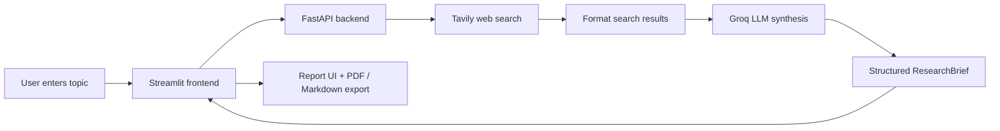

# Research Mind

**Research Mind** is an AI-powered research assistant. Enter any topic, and the app searches the web, analyzes sources with a large language model, and produces a structured research report you can read in the browser or download as PDF or Markdown.

---

## Table of Contents

- [Features](#features)
- [How It Works](#how-it-works)
- [Project Structure](#project-structure)
- [Prerequisites](#prerequisites)
- [Installation](#installation)
- [Configuration](#configuration)
- [Running the Application](#running-the-application)
- [Using the App](#using-the-app)
- [API Reference](#api-reference)
- [Testing](#testing)
- [Development](#development)
- [Troubleshooting](#troubleshooting)

---

## Features

- **Web search** — Fetches current information via [Tavily](https://tavily.com/)
- **AI synthesis** — Generates structured reports using [Groq](https://groq.com/) LLMs through LangChain
- **Rich reports** — Executive summary, full markdown report, key findings, controversies, expert opinions, and cited sources
- **Two research modes** — Standard **Research** (blocking with progress steps) or **Stream** (live SSE output)
- **Export** — Download results as **PDF** or **Markdown**
- **REST API** — FastAPI backend with Swagger docs for programmatic use

---

## How It Works




1. You enter a research topic in the Streamlit UI.
2. The frontend sends a request to the FastAPI backend (`POST /research` or `POST /research/stream`).
3. The backend searches the web with Tavily and formats the results.
4. A LangChain synthesis chain sends the context to Groq and parses the response into a `ResearchBrief`.
5. The frontend displays the report and offers PDF/Markdown download buttons.

---

## Project Structure

```
ResearchMind/
├── backend/                      # FastAPI backend
│   ├── agents/
│   │   └── research_agent.py     # Search + synthesize orchestration
│   ├── api/
│   │   └── routes.py             # HTTP endpoints
│   ├── chains/
│   │   ├── synthesis_chain.py    # LLM report generation
│   │   ├── output_parser.py      # Parse LLM JSON into ResearchBrief
│   │   └── prompts.py
│   ├── memory/
│   │   └── memory_manager.py     # In-memory session history (API use)
│   ├── models/
│   │   └── schemas.py            # Pydantic request/response models
│   ├── services/
│   │   ├── research.py           # Research + follow-up service layer
│   │   └── tavily_service.py     # Tavily search integration
│   ├── tools/
│   │   └── tavily_tool.py
│   ├── utils/
│   │   ├── logger.py
│   │   ├── search_format.py
│   │   └── text_limits.py        # Token/content truncation limits
│   ├── config.py                 # Settings from .env
│   └── main.py                   # FastAPI app entry
│
├── frontend/                     # Streamlit UI
│   ├── app.py                    # App entry, session state, layout
│   ├── components/
│   │   └── sidebar.py            # Sidebar (About, developer links)
│   ├── pages/
│   │   └── research.py           # Main research page
│   ├── utils/
│   │   ├── ui.py                 # Hero, examples, cards, status UI
│   │   ├── pdf_export.py         # PDF generation (fpdf2)
│   │   └── report_export.py      # Markdown export
│   └── styles.css                # Custom theme and layout
│
├── sample_outputs/               # Example ResearchBrief JSON fixtures
├── tests/
│   └── test_parser.py            # Output parser unit tests
│
├── run_backend.py                # Start backend (recommended)
├── run_frontend.py               # Start frontend (recommended)
├── requirements.txt
├── .env.example                  # Environment variable template
└── README.md
```

---

## Prerequisites

- **Python 3.9+**
- **pip**
- API keys:
  - [Groq API key](https://console.groq.com/) — LLM inference
  - [Tavily API key](https://tavily.com/) — web search
  - LangSmith API key — required by config (tracing is off by default; use any placeholder if you are not tracing)

---

## Installation

### 1. Clone the repository

```bash
git clone https://github.com/silyones/ResearchMind.git
cd ResearchMind
```

### 2. Create and activate a virtual environment

**Windows (PowerShell):**

```powershell
python -m venv venv
.\venv\Scripts\Activate.ps1
```

**macOS / Linux:**

```bash
python -m venv venv
source venv/bin/activate
```

### 3. Install dependencies

```bash
pip install -r requirements.txt
```

### 4. Set up environment variables

```bash
cp .env.example .env
```

Edit `.env` and add your API keys (see [Configuration](#configuration) below).

---

## Running the Application

Research Mind runs as two processes: a **backend API** and a **Streamlit frontend**. Start both from the project root.

### Terminal 1 — Backend

```bash
python run_backend.py
```

Backend runs at **[http://localhost:8000](http://localhost:8000)**

- Health check: [http://localhost:8000/health](http://localhost:8000/health)
- API docs: [http://localhost:8000/docs](http://localhost:8000/docs)

### Terminal 2 — Frontend

```bash
python -m streamlit run run_frontend.py
```

Frontend runs at **[http://localhost:8501](http://localhost:8501)**

> **Note (Windows):** If `streamlit` is not on your PATH, always use `python -m streamlit run run_frontend.py` from the activated virtual environment.

---

## Using the App

Open **[http://localhost:8501](http://localhost:8501)** in your browser.

### Step-by-step

1. **Enter a topic** in the text field (e.g. `Renewable energy trends in 2026`).
2. Choose how to run research:
  - **Research**: Runs the full pipeline and shows step-by-step progress (`Searching…` → `Analyzing…` → `Writing…`).
  - **Stream**: Connects to the streaming endpoint and shows live output as the report is built.
3. **Or try an example**: Click one of the sample topic buttons on the home screen. Example buttons hide once research starts.
4. **Wait for completion**: Research typically takes 15–60 seconds depending on topic and API latency.
5. **Read the report**: When finished, you will see:
  - Executive summary
  - Full research report (markdown sections)
  - Key findings, controversies, and expert opinions (expandable)
  - Numbered source list with links
6. **Export** — Use the **PDF** or **Markdown** download buttons at the top of the report.

### What you get in a report

Each research result is a **Research Brief** containing:


| Section         | Description                                                                             |
| --------------- | --------------------------------------------------------------------------------------- |
| Overview        | Short executive summary                                                                 |
| Report          | Full markdown report (Background, Analysis, Key Developments, Implications, Conclusion) |
| Key findings    | Detailed bullet findings with source URLs                                               |
| Controversies   | Debates or open questions on the topic                                                  |
| Expert opinions | Notable viewpoints from sources                                                         |
| Conclusion      | Final synthesis                                                                         |
| Sources         | Titles, URLs, and dates                                                                 |


### Sidebar

The sidebar shows a short **About** section and **Developer links** to the backend API and Swagger docs.

---

## API Reference

The backend exposes a REST API. Interactive documentation is available at **[http://localhost:8000/docs](http://localhost:8000/docs)** while the server is running.

### Endpoints


| Method | Path                    | Description                             |
| ------ | ----------------------- | --------------------------------------- |
| `GET`  | `/health`               | Health check and model info             |
| `POST` | `/research`             | Run research on a topic                 |
| `POST` | `/research/stream`      | Stream research results (SSE)           |
| `POST` | `/followup`             | Follow-up question with session context |
| `GET`  | `/history/{session_id}` | Get conversation history for a session  |


### Example: run research

```bash
curl -X POST "http://localhost:8000/research?session_id=default" \
  -H "Content-Type: application/json" \
  -d "{\"topic\": \"AI regulation updates worldwide\"}"
```

### Example: health check

```bash
curl http://localhost:8000/health
```

---

## Testing

Run the test suite from the project root:

```bash
pytest tests/ -v
```

Current tests cover the LLM output parser (`backend/chains/output_parser.py`) using fixtures in `sample_outputs/`.

---

## Development

### Code formatting

```bash
black backend/ frontend/ tests/
```

### Linting

```bash
ruff check backend/ frontend/ tests/
```

### Adding dependencies

```bash
pip install <package>
pip freeze > requirements.txt
```

---

## Troubleshooting


| Problem                           | Likely cause              | Fix                                                         |
| --------------------------------- | ------------------------- | ----------------------------------------------------------- |
| `Cannot connect to backend` in UI | Backend not running       | Start with `python run_backend.py`                          |
| `401 Unauthorized` from Groq      | Invalid `GROQ_API_KEY`    | Update key in `.env` and restart backend                    |
| `streamlit` command not found     | CLI not on PATH           | Use `python -m streamlit run run_frontend.py` inside venv   |
| Research timeout                  | Slow API or large topic   | Try a simpler topic; increase `REQUEST_TIMEOUT` in `.env`   |
| Token / context errors            | Input too large for model | Lower `MAX_SEARCH_RESULTS` or `MAX_CONTEXT_CHARS` in `.env` |
| PDF download fails                | Missing `fpdf2`           | Run `pip install fpdf2` in your virtual environment         |


---

## Tech Stack


| Layer    | Technology                      |
| -------- | ------------------------------- |
| Backend  | FastAPI, Uvicorn, Pydantic      |
| Frontend | Streamlit                       |
| AI       | LangChain, LangChain-Groq, Groq |
| Search   | Tavily                          |
| Export   | fpdf2 (PDF)                     |
| Testing  | pytest                          |


---

## License

MIT License 

---

